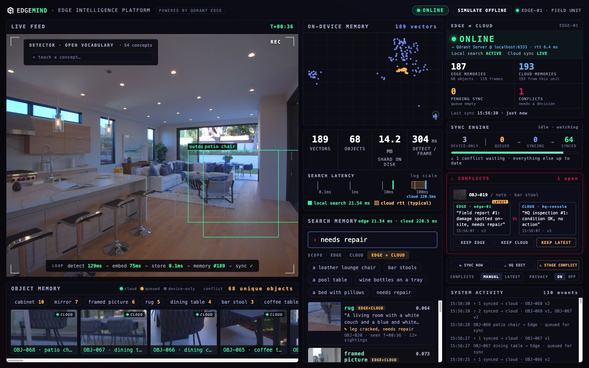
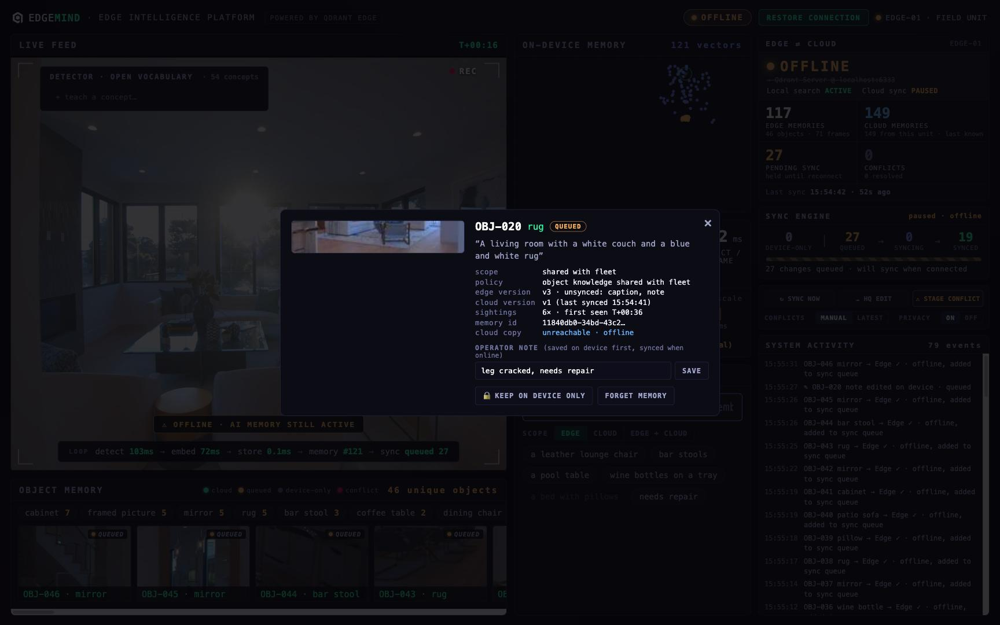
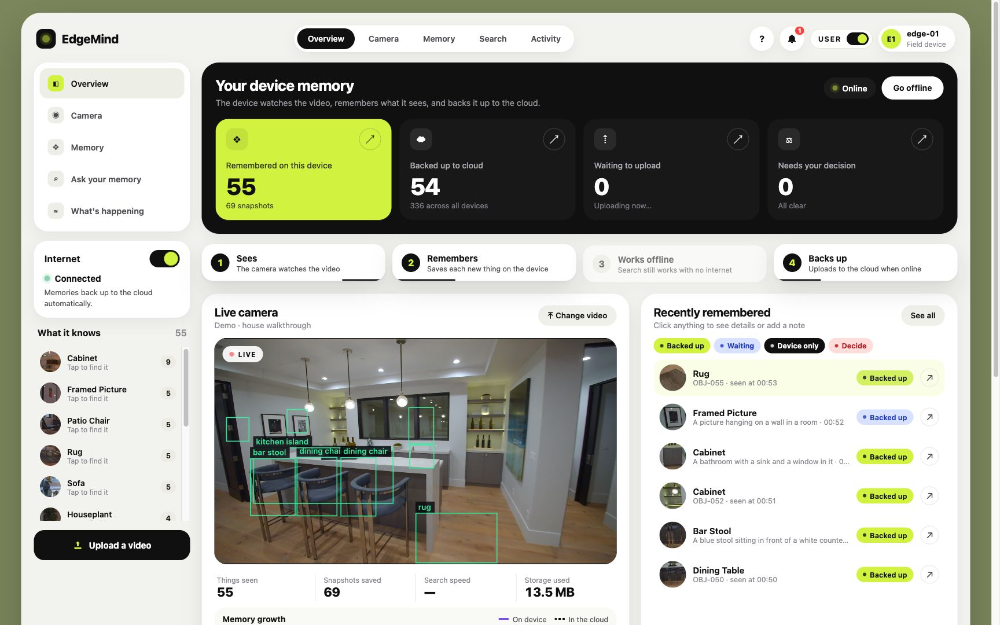
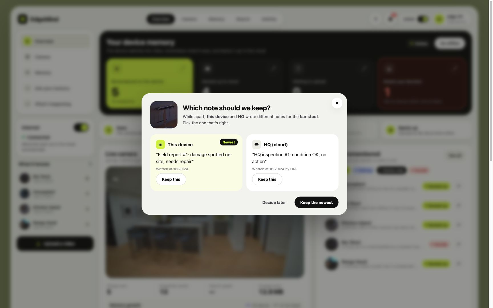
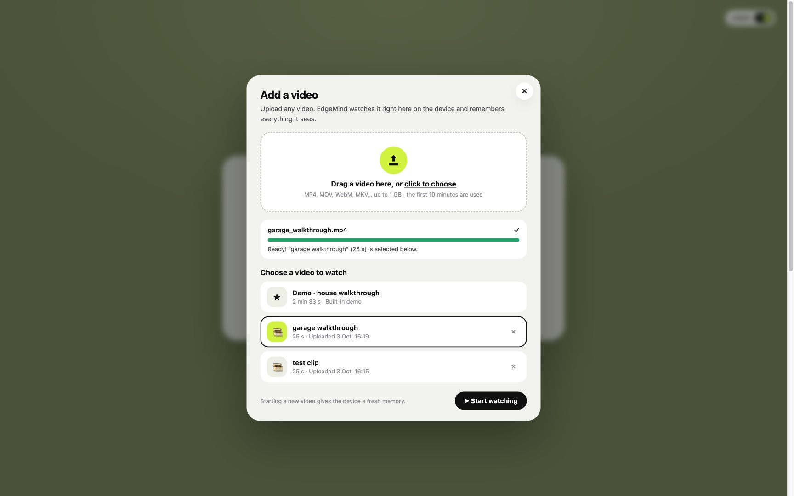
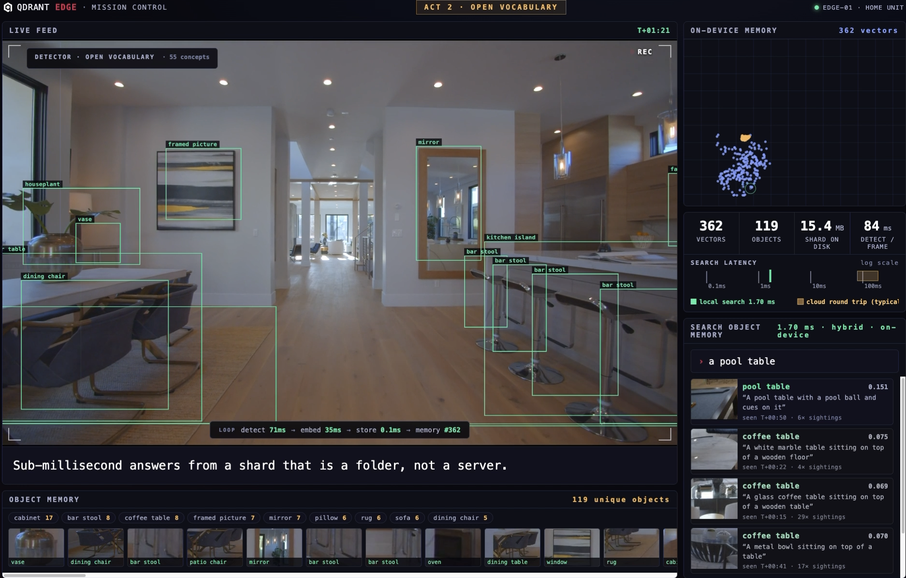

# EdgeMind: AI-Powered Edge Memory & Intelligence Platform

**AI memory that works even when the internet doesn't.** An edge device
perceives its surroundings, turns every observation into a searchable semantic
memory on the device (Qdrant Edge), keeps working fully offline, and
reconciles its knowledge with a central Qdrant Server whenever connectivity
returns, including conflicting edits made in the cloud meanwhile.

Built on top of [Qdrant Edge Mission Control](https://github.com/qdrant-labs/edge-mission-control)
(documented below). The AI pipeline (YOLOE, SigLIP2, Florence-2, Qdrant Edge
hybrid search) is unchanged; EdgeMind adds the edge ⇄ cloud layer.





```
                         EDGE DEVICE (one process, no network needed)
 camera ─► YOLOE detect+track ─► SigLIP2 embed ─► Florence-2 caption
                                     │
                                     ▼
                       Qdrant Edge shard (dense + BM25, hybrid RRF)  ◄── local search, always on
                                     │ every semantic change
                                     ▼
            Sync policy ─► Sync ledger (SQLite: versions, dirty fields, queue, conflicts)
                                     │
                                     ▼   only when the link is up
                              Sync engine (3-way merge, pull, retry)
                                     │
                                     ▼
                  Qdrant Server · collection edgemind_memories (fleet memory)
                                     ▲
                       HQ console / other devices edit here too
```

## What EdgeMind Adds

| Requirement | How |
|---|---|
| Decide what stays local vs. syncs | `app/sync_policy.py`: raw frames never leave the device; objects in sensitive rooms (bathroom, bedroom) stay local under the privacy rule; everything else becomes fleet knowledge. Operators can share or retract any memory. |
| Intermittent connectivity | Every change lands in the Edge shard first, then in a durable SQLite queue (`app/sync_queue.py`). The queue coalesces to one op per memory, works by priority, retries, and survives real outages (`docker stop edgemind-qdrant`) as well as the simulated switch. |
| Sync when connected | `app/sync_manager.py` drains the queue, reading vectors and payloads straight out of the Edge shard and upserting them to Qdrant Server with the same dense + sparse layout. |
| Evolving memory | Captions arrive later, operators annotate, HQ edits in the cloud. Every memory carries a version, per-field timestamps and authors; cloud-side edits are pulled down and re-indexed (BM25) on the device. |
| Conflicts | Three-way merge against the last-synced snapshot: disjoint edits merge automatically, telemetry merges with `max()`, same-field edits become a conflict. Resolve with Keep Edge / Keep Cloud / Keep Latest, or switch to the automatic latest-wins policy. |
| User-facing interface | Network switch, edge/cloud counters, sync engine progress, conflict cards, live activity log, per-object sync badges, memory inspector (note, share/retract, forget), and Edge / Cloud / Edge + Cloud search scope. |

### Sync Algorithm (per queued memory)

```
cloud copy absent                 -> upload (v1)
cloud.version == base_version     -> fast-forward upload (v+1)
cloud changed, different fields   -> adopt cloud fields on the edge, upload merge
cloud changed, same field         -> CONFLICT: hold, ask operator (or latest wins)
offline / cloud unreachable       -> keep queued, retry on reconnect
```

## Running EdgeMind

```bash
make setup footage prepare   # one time (see below)
make cloud                   # Qdrant Server in Docker (optional: falls back to embedded mode)
make run                     # http://localhost:8000
make test-sync               # end-to-end sync engine check, no models needed
```

Environment overrides: `EDGEMIND_CLOUD_URL` (e.g. a Qdrant Cloud URL),
`EDGEMIND_CLOUD_API_KEY`, `EDGEMIND_DEVICE_ID`.

### Demo Script (about 3 minutes)

1. **Online.** Start the mission. Objects appear in Object Memory with a
   green CLOUD badge as they sync, and the Edge ⇄ Cloud panel counts up.
2. **Local search.** Search "wine bottles on a tray" with scope EDGE and
   note the sub-millisecond latency.
3. **Kill the network.** Click SIMULATE OFFLINE (or press `O`). Search
   still answers locally. Scope CLOUD reports the cloud as unreachable.
4. **Remember offline.** New objects get amber QUEUED badges and Pending
   sync climbs. Click an object and add a note ("leg cracked"). The note is
   searchable locally right away (try the "needs repair" chip later).
5. **Conflict brewing.** Click STAGE CONFLICT. HQ edits a memory's note in
   the cloud while the field device edits the same note.
6. **Reconnect.** Click RESTORE CONNECTION. The queue drains with a progress
   bar, cloud edits are merged or pulled, and the conflict card appears:
   EDGE vs CLOUD with timestamps. Click KEEP LATEST.
7. **Fleet memory.** Search with scope EDGE + CLOUD. Results are labeled by
   source, including memories from earlier missions in the central store.

Append `?auto` for a self-playing version of this story.

## User Mode (Simple View) and Your Own Videos

Flip the **USER** toggle in the header, or on the title screen, to switch from the
operator console to a light dashboard written for non-technical users. The
choice is remembered per browser. Both views share the same live session,
and the camera feed moves between them.



- **Your device memory:** four tiles show what is remembered on the device,
  what is backed up to the cloud, what is waiting to upload, and what needs
  a decision. Each tile is clickable: open memory, search the cloud, sync
  now, or resolve a conflict.
- **How it works:** a strip with four steps (Sees, Remembers, Works offline,
  Backs up) that lights up from the live state.
- **Live camera:** stats and a memory growth chart (on-device vs. in the
  cloud, with a hover tooltip), plus "Teach it something new" (open
  vocabulary).
- **Recently remembered:** thumbnails with status pills (Backed up,
  Waiting, Uploading, Device only, Decide). Click one to add a note, keep
  it on the device, or forget it.
- **Ask your memory:** plain-language search with a scope dropdown (This
  device / Cloud / Both) and image result cards labeled Best / Good / Weak
  match, showing where and when each thing was seen.
- **What's happening:** the activity log in plain language, with routine
  events folded together. A bell collects important events.
- **Which note should we keep?** When HQ and the device edit the same note,
  a friendly chooser opens automatically, with a "Newest" hint and one-click
  "Keep the newest".



**Upload any video** with "Upload a video" in user mode, "⤒ VIDEO" in the
operator header, or "Upload your own video" on the title screen. You can
also drag a file anywhere onto the page. Uploads are converted once with
ffmpeg to browser- and OpenCV-friendly H.264 (at most 1280 px wide, 30 fps,
first 10 minutes) and stored in `footage/uploads/`, so they never leave the
device. Pick a video and click **Start watching**. A running mission is
stopped and the device starts a fresh memory for the new footage.



API: `GET /api/videos`, `POST /api/videos` (multipart `file`),
`DELETE /api/videos/{id}`, `GET /footage/{id}.mp4`. The WebSocket `start`
command accepts `video` (id) and `force` (switch even if a run is active).

## Our Contribution vs. the Base

The **base repo** provides Qdrant Edge, YOLOE, SigLIP2, Florence-2, tracking,
the object registry, hybrid retrieval and the Mission Control UI.

**EdgeMind adds** the edge/cloud memory model, sync policy, durable sync
queue, sync engine with three-way merge, cloud pull, conflict detection and
resolution, connectivity handling (simulated and real), operator memory
controls, scoped edge/cloud search, the activity stream, and the field
operations framing, the user mode dashboard and video uploads. New files:
`app/sync_manager.py`, `app/sync_queue.py`, `app/sync_policy.py`,
`app/cloud_store.py`, `app/videos.py`, `static/user.js`, `static/user.css`,
`scripts/test_sync.py`.

---

# Base: Qdrant Edge Demo: Robot Object Memory

An interactive demo of [Qdrant Edge](https://qdrant.tech/edge/): an in-process
vector search engine running inside one Python process, with no server and no
network in the loop.

See the [Live Demo](https://qdrant-edge-mission-control.vercel.app/)



[Watch the full 2:35 demo run](docs/screenshots/edge-demo.mp4): detection,
search, and live teaching, end to end.

A home robot patrols a house. Every object it sees becomes an individual,
searchable memory, entirely on the device:

- **YOLOE** (open vocabulary) detects and tracks every object in view.
- **SigLIP2** embeds each confirmed object and each frame into one
  cross-modal space.
- **Florence-2** captions every object asynchronously ("a chrome bar stool
  sitting on top of a wooden floor").
- **Qdrant Edge** stores it all in a shard that is a folder, not a server:
  dense vision vectors, sparse BM25 vectors over the captions, payload
  indexes, and facets.

Searches are hybrid queries (dense + BM25 fused with reciprocal rank fusion)
that run in well under a millisecond. The whole demo is one process on one
machine: no server, no cloud, no network. Airplane mode changes nothing.

While the 2:33 patrol plays, you drive:

- **Search the robot's object memory.** Type anything you remember from the
  feed ("wine bottles on a tray") and press Enter, or use the suggestion
  chips. Results are objects: the crop, its caption, when it was seen, plus
  full-frame moments. Weak matches are dimmed and flagged.
- **Watch the inventory grow.** Every discovered object lands in the Object
  Memory rail with live per-class facet counts, computed by the shard. Click
  a facet to query that class.
- **Teach a concept.** Type a phrase into the detector HUD ("a surfboard")
  and the robot starts detecting it immediately: one text embedding, applied
  live in about 300 ms, no retraining.
- **Explore the memory map.** Blue dots are frame memories, amber dots are
  objects; hover to see what each one remembers.

After the mission ends the memory stays searchable; Replay Mission starts a
fresh run. Append `?auto` to the URL for a self-playing scripted version
suited to screen recording.

Everything on screen is real work: real detections, real embeddings, real
captions, a real Edge shard answering hybrid queries, real measured latency.
The cloud round-trip band on the latency strip is a labeled typical range for
comparison, not a measurement.

## Requirements

- [uv](https://docs.astral.sh/uv/) (Python 3.11–3.13 managed automatically)
- ffmpeg (`brew install ffmpeg`)
- Chrome or any modern browser
- Apple Silicon recommended (the detector and captioner run on MPS). The
  whole pipeline runs at about 1.5x realtime on an M-series CPU/GPU with no
  discrete GPU needed.

No Docker, no Qdrant server, no network after setup.

## Setup (One Time, ~15 Minutes)

```bash
make setup      # python deps + models (~3 GB: SigLIP2, YOLOE, Florence-2)
make footage    # download the 9 source clips from Pexels (~160 MB)
make prepare    # stitch mission.mp4, fit the memory map, verify retrieval
```

`make prepare` ends by running the full object pipeline offline and checking
that every scripted query retrieves the right objects from the right part of
the footage; it fails loudly if retrieval is off.

## Running the Demo

```bash
make run
```

Open http://localhost:8000, make the window full screen, and press Space or
click when the title card says "press space or click to begin". If the title
card says "connecting", the server is still warming the models (~40 s after
launch).

Between runs: use Replay Mission, or restart the server (`make run` wipes all
demo state) and reload the page.

## Verifying Changes

- `make test` runs a headless full-length pass of the scripted mode and checks
  the event stream (server must be running).
- `uv run python scripts/test_objects.py` runs the real pipeline offline
  (no server) and checks object retrieval for every scripted query. Use
  `--seconds 35` for a quick pass while iterating.
- `uv run python scripts/capture_run.py` drives a full scripted run in headless
  Chrome and saves per-act screenshots to /tmp/edge-shots. One-time setup:
  `uv run playwright install chromium`.

## How It Works

One ingest tick (3 per second of mission time):

1. `detector.py` runs YOLOE-11L with a ~50-term household vocabulary,
   tracking every detection across frames (BoT-SORT). ~80–120 ms on MPS.
2. `pipeline.py` embeds the whole frame with SigLIP2 and upserts it as a
   `kind=frame` point. ~30 ms.
3. `registry.py` confirms a track into an object identity after 3 sightings:
   it picks the best crop seen so far (confidence × size × sharpness), embeds
   it, and either merges it into a known object (cosine re-id across camera
   cuts) or upserts a new `kind=object` point.
4. `captioner.py` captions new objects on a background thread with
   Florence-2-base (~0.2 s each). The caption lands in the object's payload
   and as a sparse BM25 vector, built and stored inside the Edge shard.

A query embeds the text once with SigLIP2, then runs two prefetches inside
the shard (dense cosine over crops, BM25 over captions), fuses them with
reciprocal rank fusion, and returns scored objects with payloads. A second
MMR query returns diverse full-frame moments. Both run in-process; no
network, no server, no IPC.

## Layout

- `app/session.py` owns a run: shard, pipeline, query path.
- `app/pipeline.py` is the live loop: capture, detect, embed, upsert, paced
  to video time.
- `app/detector.py` wraps YOLOE: open-vocabulary detection + tracking, live
  vocabulary extension.
- `app/registry.py` turns tracks into persistent object identities.
- `app/captioner.py` is the async Florence-2 enrichment worker.
- `app/edge_store.py` wraps the Edge shard: dense + sparse vectors, hybrid
  RRF queries, payload indexes, facets.
- `app/director.py` is the `?auto` mode script: timeline, captions, queries.
- `app/constants.py` holds the tunables: detector vocabulary, confirmation
  thresholds, ingest rate, cloud URL.
- `static/` is the mission-control UI (vanilla JS, three canvases,
  WebSocket-driven).
- `scripts/` holds footage prep and the test harnesses.

## Customizing

- Detector vocabulary: edit `DETECTOR_VOCAB` in `app/constants.py` (or teach
  concepts live from the HUD).
- Scripted timeline (auto mode): edit `TIMELINE` in `app/director.py`.
  Validate new queries with `scripts/test_objects.py` before relying on them.
- Different footage: drop clips into `footage/`, list them with trim points in
  `CLIPS` in `scripts/prepare_footage.py`, then `make prepare`. The pipeline
  is source-agnostic; anything OpenCV can read works.

Footage: nine walkthrough clips of one home by Kindel Media (living room,
dining, kitchen, game room, hallway, bedroom, bathroom, patio, backyard), free
for commercial use under the [Pexels License](https://www.pexels.com/license/),
stitched to 1080p30.

Models: YOLOE-11L-seg via Ultralytics (AGPL-3.0) for detection,
`florence-community/Florence-2-base` (MIT) for captions, SigLIP2-base ONNX
(Apache-2.0) for embeddings. About 3 GB total, all running locally.
